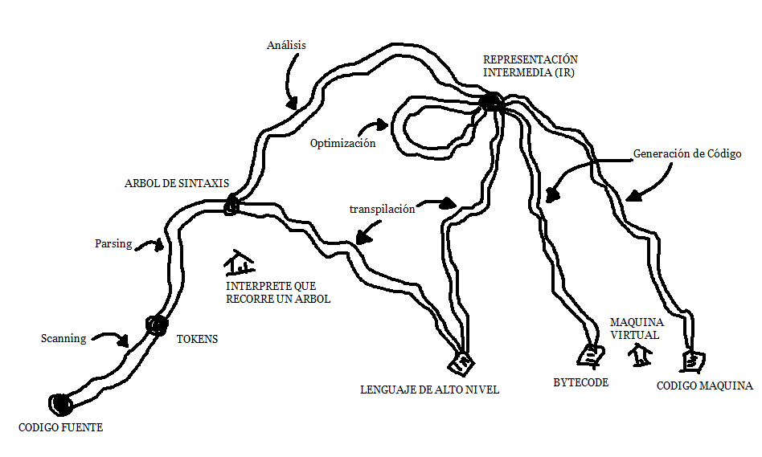

# Capitulo 2: Las piezas que componen un lenguaje

| [↩️ Volver al inicio del Proyecto](../README.md) | [⬅️ Ir a Capítulo 1](../docs/01-Bienvenido.md) |
| :----------------------------------------------: | :--------------------------------------------: |

<br/><hr/><br/>

Desde siempre hemos buscado que las computadoras **entiendan nuestras instrucciones**, y por eso creamos **lenguajes de programación**.

Aunque las máquinas sean hoy más rápidas, los principios para construir un lenguaje **siguen siendo los mismos**.

Este capítulo ofrece una **visión panorámica** de compiladores, intérpretes, JIT, VM y runtime. No necesitas memorizar todo; lo importante es **ver cómo se conectan las piezas** y usar este mapa como guía para los próximos capítulos.

<br/><hr/><br/>

# 📚 Índice del Capítulo 2

| Sección                                                                                                                                      | Descripción                                                                                                                   |
| :------------------------------------------------------------------------------------------------------------------------------------------- | :---------------------------------------------------------------------------------------------------------------------------- |
| [1. ✍️ Dibujando el lenguaje en un papel](#1-️-dibujando-el-lenguaje-en-un-papel)                                                            | Cómo un boceto inicial se convierte en un mapa claro del programa.                                                            |
| [2. 🔍 Escaneo (Scanning o Lexing)](#2--escaneo-scanning-o-lexing)                                                                           | Primer paso: convertir texto crudo en tokens listos para el análisis.                                                         |
| [3. 👀 ¿Qué es el escáner léxico (lexer)?](#3--qué-es-el-escáner-léxico-o-lexer)                                                             | Explicación de cómo el lexer organiza caracteres en bloques significativos.                                                   |
| [4. 🧩 ¿Qué es un token?](#4--qué-es-un-token)                                                                                               | Concepto de token y ejemplos prácticos de los distintos tipos.                                                                |
| [5. 🔧 De texto a tokens: primer paso del compilador](#5--de-texto-a-tokens-primer-paso-del-compilador)                                      | Cómo el lexer encaja en el proceso general del compilador.                                                                    |
| [6. 🌲 Análisis Sintáctico (Parsing)](#6--análisis-sintáctico-parsing)                                                                       | Cómo los tokens se organizan en estructuras jerárquicas (AST).                                                                |
| [7. 💬 Análisis Semántico: Entendiendo el Significado del Código](#7--análisis-semántico-entendiendo-el-significado-del-código)              | Verifica que el programa tenga sentido lógico y coherente según las reglas del lenguaje.                                      |
| [8. 🛠️ Representaciones Intermedias (Intermediate Representations – IR)](#8-️-representaciones-intermedias-intermediate-representations--ir) | Forma intermedia de código que conecta el front end y back end, facilitando optimización y soporte multi-lenguaje.            |
| [9. ⚡ Optimización (Optimization)](#9--optimización-optimization)                                                                           | Cómo mejorar el código para que sea más rápido o eficiente sin cambiar su funcionamiento.                                     |
| [10. 💻 Generación de Código (Code Generation)](#10--generación-de-código-code-generation)                                                   | Convertir la representación intermedia optimizada en instrucciones que la máquina pueda ejecutar.                             |
| [11. 🖥️ Máquina Virtual (Virtual Machine – VM)](#11-️-máquina-virtual-virtual-machine--vm)                                                   | Ejecutar bytecode en una máquina virtual o generar mini-compiladores para cada arquitectura.                                  |
| [12. ⏱️ Tiempo de Ejecución (Runtime)](#12-️-tiempo-de-ejecución-runtime)                                                                    | Servicios necesarios durante la ejecución, como garbage collector, rastreo de tipos y librerías estándar.                     |
| [13. 🛣️ Atajos y rutas alternativas](#13-️-atajos-y-rutas-alternativas)                                                                      | Compiladores de un solo paso y traducción dirigida por la sintaxis para simplificar el pipeline de compilación.               |
| [14. 🌳 Intérpretes de recorrido de árbol (Tree-walk interpreters)](#14--intérpretes-de-recorrido-de-árbol-tree-walk-interpreters)           | Ejecutar directamente el AST, ideal para lenguajes educativos o proyectos pequeños, aunque lento.                             |
| [15. 🔄 Transpilador (Transpiler)](#15--transpilador-transpiler)                                                                             | Traducir código de un lenguaje a otro de alto nivel, usando el lenguaje destino como IR intermedia.                           |
| [16. ✨ Compilación Just-in-Time (JIT)](#16--compilación-just-in-time-jit)                                                                   | Compilar al vuelo a código nativo, combinando portabilidad y rendimiento, con optimización dinámica de “hot spots”.           |
| [17. 📚 Compiladores e Intérpretes (Compilers and Interpreters)](#17--compiladores-e-intérpretes-compilers-and-interpreters)                 | Diferencias entre compiladores e intérpretes, ejemplos y cómo los lenguajes modernos combinan ambos enfoques.                 |
| [18. 📝 Ejercicio Propuesto](#18--ejercicio-propuesto-en-desarrollo)                                                                                       | Explora el código fuente de un intérprete o compilador open source para identificar cómo convierte el código en tokens y AST. |

<br/><hr/><br/>

## 1. ✍️ Dibujando el lenguaje en un papel

Pensemos que crear un lenguaje empieza como un **boceto**. Nada grandioso, solo una idea garabateada con entusiasmo.



Al principio, el programa es **solo texto crudo** —una lista de símbolos sin mucho sentido por sí mismos. Pero poco a poco, vamos **trazando líneas, conectando ideas y dándole forma**. Cada paso nos ayuda a **organizar y entender mejor** lo que el código quiere expresar.

Al final, este garabato lleno de rayones se convierte en un **mapa claro del programa**.

> Todo gran lenguaje empezó alguna vez como un garabato en un papel.

Nuestro recorrido comienza con el **texto en bruto del código fuente** del usuario.

A lo largo de la historia, hubo muchos intentos fallidos y caminos sin salida: ideas que parecían prometedoras, pero que el tiempo dejó atrás. Aun así, esos experimentos forman parte del mapa de la computación y nos recuerdan que incluso los errores ayudan a construir el conocimiento.

<br/><hr/><br/>

## 2. 🔍 Escaneo (Scanning o Lexing)

El primer paso para entender el código es el **escaneo**, también llamado **análisis léxico**.

En esta etapa, el programa deja de ser una simple secuencia de letras y símbolos y se convierte en una lista de **tokens** —las “palabras” del lenguaje.

Un **scanner** (o **lexer**) lee el texto y lo divide en partes con significado:  
números, nombres, paréntesis, operadores o cadenas.

Al mismo tiempo, ignora lo que no aporta nada al código, como los **espacios en blanco** o los **comentarios**.

El resultado es una secuencia limpia y ordenada de tokens.

<br/><hr/><br/>

## 3. 👀 ¿Qué es el escáner léxico (o lexer)?

Cuando escribes un programa, lo que tienes es texto plano: letras, números, signos y espacios.

Por ejemplo:

```javascript
var suma = 10 + 5;
```

Para una computadora, eso al principio es solo una cadena de caracteres:

```java
v a r   s u m a   =   1 0   +   5 ;
```

El escáner léxico (también llamado **lexer**) es el encargado de leer ese texto y darle estructura, separándolo en bloques con significado, llamados **tokens**.

<br/><hr/><br/>

## 4. 🧩 ¿Qué es un token?

Un token es como una pequeña etiqueta que indica qué tipo de cosa representa una parte del código. Por ejemplo, el código anterior se convertiría en esta lista de tokens:

| Texto  | Tipo de token | Descripción        |
| :----- | :------------ | :----------------- |
| `var`  | KEYWORD       | Palabra reservada  |
| `suma` | IDENTIFICADOR | Nombre de variable |
| `=`    | OPERADOR      | Asignación         |
| `10`   | NÚMERO        | Valor numérico     |
| `+`    | OPERADOR      | Suma               |
| `5`    | NÚMERO        | Valor numérico     |
| `;`    | PUNTUACIÓN    | Fin de instrucción |

El escáner también puede guardar la posición (línea y columna) de cada token.
Esto sirve para que, si hay un error, el compilador pueda decirte exactamente dónde ocurrió.

<br/><hr/><br/>

## 5. 🔧 De texto a tokens: primer paso del compilador

El lexer es la primera etapa del proceso de compilación o interpretación:

```text
🔠 Texto crudo  →  🧮 Tokens  →  🧱 Estructura del programa
   (Scanner)        (Parser)
```

Primero, el **scanner** divide el texto en tokens.  
Después, el **parser** (analizador sintáctico) toma esos tokens y los **organiza** según las reglas del lenguaje.

Cada etapa se apoya en la anterior: el escaneo prepara el terreno, y el parser empieza a darle forma al código para que el lenguaje pueda interpretarlo o compilarlo correctamente

<br/><hr/><br/>

## 6. 🌲 Análisis Sintáctico (Parsing)

El siguiente paso después del escaneo es el **parsing**, o análisis sintáctico.  
Aquí es donde el código empieza a **tomar forma**: el parser entiende cómo juntar las piezas (tokens) para formar expresiones y sentencias más grandes.

Un **parser** toma la secuencia de tokens y la organiza en una **estructura jerárquica**, mostrando cómo las distintas partes del código se relacionan entre sí 🌳. En la práctica, esa estructura se llama **árbol de sintaxis** o **AST** (Abstract Syntax Tree).

Para nosotros, lo importante es entender que **el parser da forma y sentido al código**, y nos permite trabajar con él de manera ordenada.

**💡 Apunte técnico**

El parser **convierte la lista de tokens** en una **estructura organizada** (AST = “árbol de sintaxis abstracta” o "abstract syntax tree") que refleja la lógica y jerarquía del programa.  
Esta estructura es clave para los siguientes pasos del compilador o intérprete, como:

- Revisar que el código tenga sentido (**análisis semántico**)
- Generar código que la máquina pueda ejecutar
- Optimizar el programa para que sea más rápido o eficiente

Por lo tanto:

🎟️ Tokens → 🌳 Árbol de sintaxis → 🏗️ Estructura lógica del programa

> 💡 Sin parsing, el compilador vería solo una lista de símbolos sin sentido.  
> Con él, el código **adquiere forma, jerarquía y lógica**, listo para ser entendido y procesado.

<br/><hr/><br/>

## 7. 💬 Análisis Semántico: Entendiendo el Significado del Código

> Hasta ahora, ya tenemos nuestro código dividido en tokens (gracias al lexer) y organizado en una estructura lógica (gracias al parser). Pero… ¿el programa tiene sentido? ❓

Por ejemplo, mira este código:

```javascript
var x = "hola";
x = x + 10;
```

El parser no ve ningún problema aquí: la estructura está bien. Pero, desde el punto de vista del significado, algo está mal. ¡Estamos intentando sumar un número a una cadena de texto! Y ahí es donde entra en juego el análisis semántico.

<br/>

🔍 **¿Qué hace el análisis semántico?**

El análisis semántico revisa que las operaciones y relaciones del programa tengan **sentido lógico**, según las reglas del lenguaje.

Algunas tareas comunes del análisis semántico son:

Tarea Descripción
| Verificación | Descripción |
| :--------------- | :------------------------------------------------------------ |
| **Tipos** | Que las operaciones sean válidas (no sumar texto con números). |
| **Nombres** | Que las variables y funciones existan antes de usarlas. |
| **Ámbito (scope)** | Qué variables son visibles dentro de cada bloque. |

Por ejemplo:

- Podemos imaginarlo como una fábrica de ideas 🏭. **Primero**, el **lexer** corta la materia prima en piezas pequeñas (los **tokens**). Después, el **parser** ensambla esas piezas en un producto con forma (el **Árbol de sintaxis AST**). Y finalmente, el **analizador semántico** revisa que todo funcione correctamente antes de salir al mundo —que las piezas encajen y el resultado tenga sentido ⚙️.

| Etapa         | Resultado esperado   |
| :------------ | :------------------- |
| **Lexer**     | Palabras correctas   |
| **Parser**    | Oraciones correctas  |
| **Semántico** | Significado correcto |

<br/>

### 🧰 ¿Qué obtiene el compilador de esta etapa?

Después de este paso, el compilador tiene un programa que:

- Tiene estructura correcta (gracias al parser)
- Tiene significado válido (gracias al análisis semántico)

En otras palabras, el código no solo está bien escrito, sino que tiene lógica. Y con eso, ya está listo para pasar a las siguientes fases del viaje: la **generación de código** o la **interpretación** 🎯.

<br/>

### 💬 Entonces, tenemos el siguiente camino recorrido:

| Etapa         | Qué hace                  | Resultado                    |
| :------------ | :------------------------ | :--------------------------- |
| **Lexer**     | Divide el texto en tokens | 🧩 Lista de tokens           |
| **Parser**    | Da estructura al código   | 🌳 Árbol de sintaxis (AST)   |
| **Semántico** | Verifica el significado   | ✅ Código coherente y válido |

Sin análisis semántico, podríamos tener programas “bien escritos” pero completamente absurdos.

<br/><hr/><br/>

## 8. 🛠️ Representaciones Intermedias (Intermediate Representations – IR)

Podemos imaginar el **compilador** como una tubería de trabajo donde cada etapa transforma el código del usuario en una forma más organizada y fácil de procesar 🏗️.

El **front-end** de esta tubería está ligado al lenguaje fuente (por ejemplo, Java, C o Python) 📜.

El **back-end**, en cambio, se enfoca en la arquitectura destino (como x86, ARM o RISC-V) ⚙️.

En el medio, el código pasa por una **representación intermedia (IR)**: una forma neutra que no depende del lenguaje original ni de la máquina final 🧩. Esta IR actúa como un puente entre ambos mundos, permitiendo que un compilador soporte múltiples lenguajes y plataformas con menos esfuerzo.

💡 **Ejemplo**

Supongamos que queremos crear compiladores para Pascal, C y Fortran, y que apunten a tres arquitecturas: x86, ARM y SPARC. Sin **IR**, tendrías que construir nueve compiladores completos (una combinación por cada caso) 😵‍💫.

Con una **IR compartida**, solo necesitas:
Un **front-end** por lenguaje (que genere la IR).
Un **back-end** por arquitectura (que traduzca desde la IR).

De esta forma, puedes mezclar y combinar libremente todas las combinaciones posibles.

<br/>

**🔧 Tipos comunes de IR**

Existen varios estilos de representación intermedia que se usan ampliamente en compiladores modernos 📚: Control Flow Graph (CFG) 🌳 - Static Single Assignment (SSA) ✏️ - Continuation-Passing Style (CPS) 🔗 - Three-Address Code (TAC) 🧮

Por lo tanto:
📜 Lenguaje fuente → 🌳 Representación intermedia (IR) → 🖥️ Arquitectura objetivo

La **representación intermedia (IR)** desacopla el front-end del back-end, haciendo el compilador modular, extensible y reutilizable. También permite aplicar optimizaciones independientes del lenguaje o la plataforma, lo que mejora la eficiencia general del programa.

<br/>

**💡 Dato curioso: Soporte de múltiples lenguajes y arquitecturas en GCC**

- GCC significa GNU Compiler Collection: Es un conjunto de compiladores de código abierto desarrollado por el proyecto GNU que permite traducir programas escritos en varios lenguajes de programación a código máquina que pueda ejecutar una computadora.

¿Alguna vez te preguntaste cómo GCC puede compilar tantos lenguajes para tantas arquitecturas distintas?

La clave está en que todos los front-ends (C, C++, Ada, etc.) generan una **IR compartida** —como **GIMPLE o RTL**.

Luego, los back-ends específicos de cada arquitectura (x86, ARM, 68k, etc.) traducen esa **IR a código nativo**.

| Parte del compilador | Función principal                  | Ejemplo      |
| :------------------- | :--------------------------------- | :----------- |
| **Front-end**        | Traduce el lenguaje fuente a IR    | C → GIMPLE   |
| **IR**               | Representación común y optimizable | GIMPLE / RTL |
| **Back-end**         | Traduce IR a código máquina        | GIMPLE → x86 |

🌳 Una **IR compartida** funciona como un puente entre los front-ends y los back-ends, permitiendo combinar muchos lenguajes y arquitecturas sin crear compiladores desde cero 🔧💡.

<br/><hr/><br/>

## 9. ⚡ Optimización (Optimization)

> Optimizar un programa significa hacerlo más rápido o eficiente sin cambiar lo que hace 🔄.

Un ejemplo simple de optimización es el **plegado de constantes (constant folding)** 🔢: si una expresión siempre da el mismo resultado, el compilador puede calcularla antes de ejecutar el programa:

```java
area = 3.14159 * (0.75 / 2) * (0.75 / 2);

se puede reemplazar por:

area = 0.4417860938;
```

Aunque la optimización es importante, muchos lenguajes como Lua o CPython hacen pocas optimizaciones en tiempo de compilación y se enfocan en el rendimiento en tiempo de ejecución.

Algunos conceptos clave de optimización: Constant propagation - Eliminación de expresiones comunes - Movimiento de código invariante de bucle - Eliminación de código muerto - Desenrollado de bucles ...

💡 Tip técnico:

- La **optimización** puede ser **local** (dentro de un bloque), **global** (en funciones o módulos) o **dependiente del hardware**. Incluso pequeñas mejoras pueden hacer tu código más rápido y eficiente.

🌳 AST / IR optimizado → 🚀 Código más rápido

<br/><hr/><br/>

## 10. 💻 Generación de Código (Code Generation)

Después de aplicar todas las optimizaciones, el último paso es convertir el programa en algo que la máquina pueda ejecutar. Esto se llama **generación de código**, y aquí “código” significa instrucciones primitivas que la CPU entiende, no el código que un humano lee.

Estamos en el back-end del compilador, nuestra representación del programa se vuelve cada vez más simple, acercándose a lo que la máquina puede ejecutar.

- Tenemos una decisión importante: **¿generamos código para una CPU real o para una máquina virtual?**

  - **Código nativo (CPU real)**: Es ultra rápido, pero difícil de generar; Cada arquitectura tiene sus propias instrucciones, pipelines y “equipaje histórico”; El compilador queda atado a esa arquitectura (ej. x86 ≠ ARM).

  - **Código para máquina virtual / bytecode**: En lugar de un chip real, generamos instrucciones para una máquina idealizada; Más portable, más fácil de implementar y más cercano a la semántica del lenguaje; Ejemplo: Java, Python o Lua usan bytecode para funcionar en diferentes plataformas.

🏗️ **Apunte técnico**:
La **generación de código** convierte la representación intermedia optimizada en instrucciones ejecutables, ya sea para CPU real con máximo rendimiento, pero depende de la arquitectura, o bien para máquina virtual / bytecode que son más portable y fácil de implementar.

> **Generar código** es el último paso que hace que nuestro programa “viva” en la máquina.

<br/><hr/><br/>

## 11. 🖥️ Máquina Virtual (Virtual Machine – VM)

Si tu compilador genera **bytecode**, todavía queda un paso: traducirlo a algo que la máquina pueda ejecutar. Como no existe un chip que lo entienda directamente, tienes dos caminos.

- El primero es hacer **mini-compiladores** para cada arquitectura. Cada **compilador** convierte el **bytecode en código nativo** para un chip específico. Es relativamente sencillo y rápido, y puedes reutilizar gran parte del pipeline del compilador. Sin embargo, todavía hay que trabajar por cada arquitectura, porque cada CPU tiene su propio "idioma".

- El segundo camino es construir una **máquina virtual (VM)**. En lugar de traducir el **bytecode** de una vez, creas un programa que simula un chip hipotético capaz de ejecutar tu bytecode. Esto es más lento porque cada instrucción **se interpreta** en tiempo real, pero es mucho más portable y sencillo: mientras tu VM funcione en una plataforma, tu lenguaje también lo hará. Es la estrategia que usan lenguajes como Java, Python y Lua.

> En pocas palabras: Usar bytecode + VM significa portabilidad y reutilización. Además de generar código nativo da máximo rendimiento. El desafío siempre es encontrar el equilibrio entre velocidad y compatibilidad.

<br/><hr/><br/>

## 12. ⏱️ Tiempo de Ejecución (Runtime)

Finalmente, tu programa está listo para ejecutarse.

- Si lo **compilaste a código máquina**, simplemente el sistema operativo carga el ejecutable y ¡listo!.

- Si lo **compilaste a bytecode**, necesitas arrancar la máquina virtual (VM) y cargar el programa allí.

Pero casi todos los lenguajes, excepto los más básicos, necesitan **servicios adicionales** durante la ejecución. Por ejemplo, si el lenguaje maneja memoria automáticamente, se requiere un **garbage collector** ♻️. Si soporta tipos dinámicos, debe mantener información sobre los objetos y su tipo.

Esto es lo que llamamos **runtime ⏱️**. En un **lenguaje totalmente compilado**, el runtime se incrusta dentro del ejecutable, como sucede en Go. En lenguajes que corren en una VM o intérprete, el runtime vive allí, como Java, Python o JavaScript.

En pocas palabras, el **runtime** proporciona los **servicios** que tu programa necesita para funcionar correctamente, como gestión de memoria, rastreo de tipos y acceso a librerías estándar.

> Resumen rápido: **Compilador + VM/Intérprete + Runtime = ejecución completa**.

<br/><hr/><br/>

## 13. 🛣️ Atajos y rutas alternativas

El camino que hemos recorrido es el largo y completo, cubriendo todas las fases posibles. Sin embargo, algunos lenguajes usan atajos para simplificar las cosas.

Algunos usan **compiladores de un solo paso**. En estos, parsing, análisis y generación de código se combinan en un solo flujo: no se crean árboles intermedios ni estructuras complicadas. Esto obliga a que cada expresión se pueda compilar en el momento exacto en que se ve. Lenguajes clásicos como Pascal y C fueron diseñados con estas limitaciones en mente. Por ejemplo, en C necesitas declarar funciones antes de usarlas.

Otra técnica es la **traducción dirigida por la sintaxis**. Aquí, cada regla de la gramática tiene asociada una acción, normalmente generar código. Cada vez que el parser reconoce esa regla, ejecuta la acción y construye el programa paso a paso.

> Los **compiladores de un solo paso** combinan parsing, análisis y generación de código en un único flujo eficiente, sin fases intermedias.

<br/><hr/><br/>

## 14. 🌳 Intérpretes de recorrido de árbol (Tree-walk interpreters)

Algunos lenguajes ejecutan el programa directamente desde el **AST (árbol de sintaxis abstracta)** justo después de parsearlo. El intérprete recorre el árbol rama por rama y hoja por hoja, evaluando cada nodo.

Este enfoque es ideal para proyectos pequeños o educativos, porque es fácil de entender. Sin embargo, no es muy rápido. **Nuestro primer intérprete será de este tipo**, decir que versiones tempranas de Ruby también usaban este método. Luego, Ruby 1.9 cambió a YARV, una VM de bytecode, para mejorar velocidad y portabilidad.

> Por lo tanto, los **tree-walk interpreters** son educativos y simples, pero lentos. Para lenguajes modernos se prefiere compilar a bytecode y ejecutarlo en una VM, lo que combina eficiencia y portabilidad.

<br/><hr/><br/>

## 15. 🔄 Transpilador (Transpiler)

Escribir un back-end completo para un lenguaje puede ser mucho trabajo. Una alternativa es usar un lenguaje existente como objetivo, tratándolo como si fuera una representación intermedia (IR). Esto es básicamente lo que hace un transpiler.

**¿Cómo funciona un transpiler?**:
Primero, escribes un front-end para tu lenguaje (scanner y parser). Luego, en lugar de generar directamente código máquina, produces código fuente válido en otro lenguaje que esté a un nivel similar al tuyo. Finalmente, utilizas las herramientas de compilación existentes de ese lenguaje para llegar a un programa ejecutable.

Antes se llamaba **source-to-source compiler** o **transcompiler**, pero hoy en día, gracias a lenguajes que compilan a JavaScript para navegadores, se les dice **transpilers**. Originalmente, muchos compiladores generaban C como lenguaje de salida, porque era portable y eficiente. Hoy, los navegadores son las “máquinas” y su “código máquina” es JavaScript, por lo que casi todos los lenguajes modernos apuntan a JS.

**¿Cómo funciona internamente?**:
Si el lenguaje fuente es muy parecido al destino, el transpiler puede saltar análisis y generar la sintaxis equivalente directamente. Si hay diferencias semánticas, se aplican fases típicas de compilación, incluyendo análisis y optimización. En la generación de código, en lugar de producir binario, se produce una cadena de código fuente correcta en el lenguaje destino. Luego, ese código se procesa con el pipeline del lenguaje destino y listo.

**💡 Apunte técnico:**
Un **transpiler** es un compilador que apunta a otro lenguaje de alto nivel, usando ese lenguaje como una IR intermedia. Esto evita tener que escribir un back-end completo y permite aprovechar las herramientas existentes del lenguaje destino.

**Front-end → Código fuente destino → Compilación existente → Ejecución**

<br/><hr/><br/>

## 16. ✨ Compilación Just-in-Time (JIT)

Este enfoque es como una escalada alpina peligrosa, mejor para expertos. El código más rápido siempre será el que esté compilado a código máquina, pero a veces no sabes de antemano la arquitectura del usuario final.

💡 La solución: **Compilación Just-in-Time (JIT)**. Cuando el programa se carga en la máquina del usuario —ya sea desde código fuente (como JavaScript) o desde bytecode independiente de plataforma (JVM, CLR)— se compila al vuelo a código nativo para esa arquitectura. Es decir, el programa se adapta al hardware real del usuario y se ejecuta lo más rápido posible.

🔍 Optimización avanzada en JIT: Los JIT más sofisticados añaden **hooks** de perfilado en el código, que permiten ver qué partes del programa se usan más y qué tipo de datos pasan por ellas. Esas **“zonas calientes” o hot spots** se pueden recompilar automáticamente con optimizaciones adicionales, aumentando la velocidad de ejecución.

- **JIT** combina **portabilidad** del bytecode con la **velocidad** del código nativo. Permite adaptarse dinámicamente al hardware del usuario, optimizando solo lo que realmente importa.

Muchos lenguajes modernos como Java, C#, JavaScript y Ruby (YARV) usan JIT para maximizar rendimiento sin perder portabilidad.

- **JIT = cargar código → compilar a nativo en tiempo real → perfilado y recompilación de hot spots**

<br/><hr/><br/>

## 17. 📚 Compiladores e Intérpretes (Compilers and Interpreters)

Después de llenar tu cabeza con toda la jerga de compiladores, máquinas virtuales y runtimes, llega la gran pregunta: **“¿Cuál es la diferencia entre un compilador y un intérprete?”**

La diferencia entre un compilador y un intérprete es como diferenciar entre un coche automático y uno manual 🚗. Parece una elección binaria, pero no lo es: un coche automático cambia de marchas solo, mientras que uno manual requiere que el conductor haga los cambios. Algunos coches modernos tienen modos mixtos, como semiautomático, que combinan lo mejor de ambos mundos.

Lo mismo pasa con los lenguajes: algunos son puramente compilados, otros puramente interpretados, y muchos modernos mezclan ambos enfoques.

> **En cuanto a lenguajes de programación:**

**Compilar** significa traducir tu código a otro lenguaje, generalmente más bajo.
Generar bytecode o código máquina = compilar.
Transpilar a otro lenguaje de alto nivel = también compilar.

Una implementación que **solo traduce** pero no ejecuta el código es un **compilador**.

Una implementación que **ejecuta** directamente el código fuente es un **intérprete**.

**Ejemplos:**

**GCC o Clang** → traducen C a código máquina. El usuario ejecuta el programa resultante. Son **compiladores**.

**Ruby (Matz)** → ejecuta el código fuente directamente. El **intérprete** recorre el AST. No hay traducción visible, es un **intérprete**.

**CPython (Python)** → convierte el código a bytecode interno y luego lo ejecuta en la VM. Desde la perspectiva del usuario, es un **intérprete**, pero bajo el capó también hay **compilación**. Conclusión: **es ambos**.

> **🧩 Apunte técnico:**

La mayoría de lenguajes modernos **mezclan interpretación y compilación**.

Cuando hagamos nuestro **segundo intérprete** también compila a bytecode, así que aunque hablemos de intérprete, la compilación también está presente. La línea entre compilador e intérprete no siempre es nítida.

Conceptos como bytecode y JIT muestran que muchos lenguajes modernos combinan ambos enfoques.

Al diseñar un lenguaje o intérprete, es útil pensar en fases de compilación y ejecución más que en etiquetas estrictas.

Concluyo que:

- **Compilador = traduce a otra forma**

- **Intérprete = ejecuta desde el código fuente**

- **Lenguajes modernos = mezcla de ambos**

<br/><hr/><br/>

## 18. 📝 Ejercicio Propuesto (en desarrollo)

- Ejercio Propuesto 1: Explorando Scanners y Parsers

  **Objetivo**: Familiarizarse con la implementación real de compiladores e intérpretes explorando código open source.

  **Instrucciones**: Elige un lenguaje open source de tu preferencia. Por ejemplo, puedes usar uno de estos repositorios en GitHub: - [CPython (Python) – El intérprete oficial de Python en C](https://github.com/python/cpython) - [PyPy (Python JIT) – Implementación alternativa de Python con JIT](https://github.com/friendlyanon/pypy) - [MRI (Ruby) – Implementación oficial de Ruby (Matz’s Ruby Interpreter)](https://github.com/ruby/ruby) - [JRuby – Ruby sobre JVM](https://github.com/jruby/jruby) - [Lua – Lenguaje ligero, famoso por embebirse en juegos](https://github.com/lua/lua) - [GHC (Glasgow Haskell Compiler) – Compilador de Haskell](https://github.com/ghc/ghc) - [Go (golang) – Lenguaje de Google, compilador y runtime incluidos](https://github.com/golang/go) - [V (Vlang) – Lenguaje moderno, compilador muy sencillo de explorar](https://github.com/vlang/v) - [Crystal – Lenguaje tipo Ruby, compilado a código nativo](https://github.com/crystal-lang/crystal) - [Nim – Lenguaje moderno, compilado a C, C++ o JavaScript](https://github.com/nim-lang/Nim)

  **Clona o descarga el repositorio en tu máquina**: Clonando con Git
  git clone https://github.com/python/cpython.git
  O descargando el ZIP desde la página de GitHub y descomprimiéndolo

  **Explora la estructura de carpetas del repositorio**. Busca carpetas o archivos relacionados con: parser - lexer - scanner - tokenizer - Grammar. Ahí suele estar la magia que convierte el código fuente en tokens y AST.

  **Investiga cómo se implementan:**
  ¿Qué significan Lex y Yacc?
  En el lenguaje que estás investigando, ¿existen archivos con extensión .l o .y? Eso te indicará si usan Lex/Yacc para generar el scanner y parser.

  **Responde las siguientes preguntas:**
  ¿Cómo organiza el lenguaje el escaneo y parsing del código fuente?
  ¿Qué tipo de archivos usa para definir la gramática o las reglas del lexer?
  ¿Puedes identificar la función que recibe el texto y devuelve los tokens?
  ¿Puedes identificar la función que construye el AST?

<br/><hr/><br/>

| [↩️ Volver al inicio del Proyecto](../README.md) | [⬆️ Ir al inicio del Capítulo](#capitulo-2-las-piezas-que-componen-un-lenguaje) | [⬅️ Ir a Capítulo 1](../docs/01-Bienvenido.md) |
| :----------------------------------------------: | :-----------------------------------------------------------------------------: | :--------------------------------------------: |
