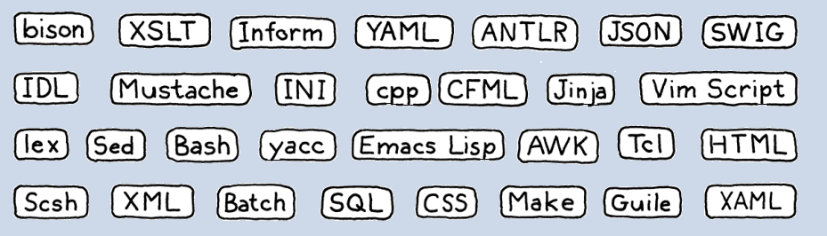

# Ejercicios Propuestos tema 1

---

| [↩️ Volver al capítulo 1](../docs/01-Bienvenido.md) | [↩️ Volver al inicio del Proyecto](../README.md) |
| :-------------------------------------------------: | :----------------------------------------------: |

---

### Ejercicio Propuesto 1

> 💬 Define qué es un lenguaje específico de dominio (DSL - Domain Specific Language) y menciona al menos cinco ejemplos.

Un lenguaje específico de dominio (DSL) es un lenguaje de programación o descripción diseñado para resolver problemas concretos dentro de un área específica 🧱📚, a diferencia de los lenguajes de propósito general (como Java o Python), que se usan para muchos tipos de aplicaciones.

1. SQL (Structured Query Language)
   💼 Dominio: Bases de datos relacionales 🗄️
   🔹 Sirve para consultar, modificar y gestionar datos en sistemas como MySQL, PostgreSQL o SQLite.
   📘 Ejemplo:

```sql
SELECT nombre, edad FROM usuarios WHERE edad > 18;
```

2. CSS (Cascading Style Sheets)
   💻 Dominio: Estilos y diseño web 🎨
   🔹 Define la apariencia visual de las páginas HTML (colores, tamaños, fuentes, etc.).
   📘 Ejemplo:

```css
h1 {
  color: blue;
  font-size: 24px;
}
```

3. HTML (HyperText Markup Language)
   🌐 Dominio: Estructura de contenido web 📄
   🔹 Define la estructura y semántica de las páginas web (texto, imágenes, enlaces…).
   📘 Ejemplo:

```html
<p>Hola, mundo!</p>
```

4. RegEx (Expresiones Regulares)
   🔍 Dominio: Procesamiento y validación de texto 🧾
   🔹 Permite buscar patrones dentro de cadenas (muy usado en programación y análisis de datos).
   📘 Ejemplo:

```text
^[A-Za-z0-9._%+-]+@[A-Za-z0-9.-]+\.[A-Za-z]{2,}$
```

5. MATLAB / Octave

📐 Dominio: Cálculo numérico, ingeniería y simulación 🔢
🔹 Pensado para matemáticas aplicadas, gráficos y simulaciones científicas.
📘 Ejemplo:

```matlab
x = 0:0.1:10;
y = sin(x);
plot(x, y);
```

Existen cientos o miles, te muestro los nombres de unos cuantos mas:



---

| [↩️ Volver al capítulo 1](../docs/01-Bienvenido.md) | [↩️ Volver al inicio del Proyecto](../README.md) |
| :-------------------------------------------------: | :----------------------------------------------: |
